# Standard ML

## exam questions

---

### question 1

#### winter 2020

<!--vert-->

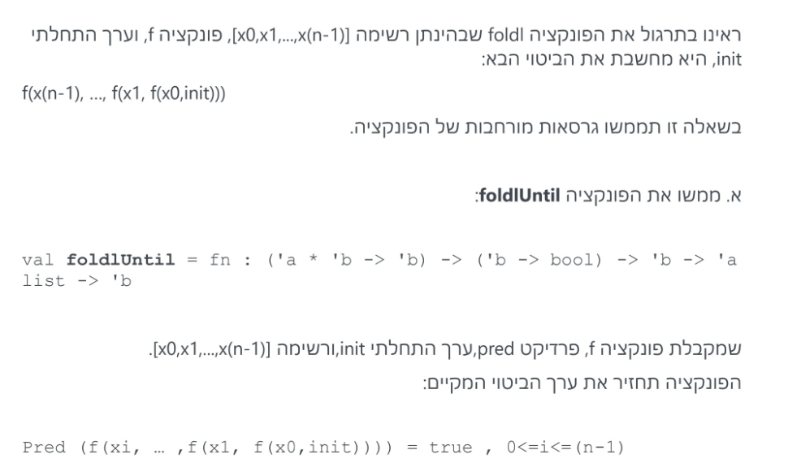

<!--vert-->

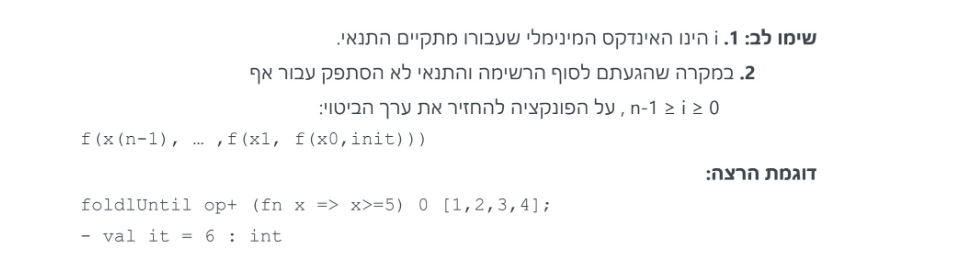

<!--vert-->

```sml
...
```
<!-- .element: data-thebe-executable-sml data-language="text/x-ocaml" -->

<!--vert-->

```sml
fun foldlUntil f pred init [] = init
  | foldlUntil f pred init (x::xs) =
    let val next = f (x, init) in
      if pred next then next else foldlUntil f pred next xs
    end;
```
<!-- .element: data-thebe-executable-sml data-language="text/x-ocaml" -->

<!--vert-->

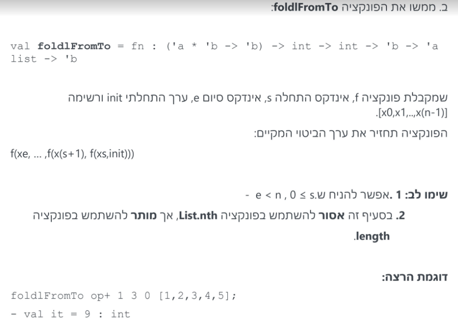

<!--vert-->

```sml
...
```
<!-- .element: data-thebe-executable-sml data-language="text/x-ocaml" -->

<!--vert-->

```sml
local
  fun sublist s e l = if s > e orelse s > List.length(l) then [] else
      List.take(List.drop(l, s), e - s + 1);
in
  fun foldFromTo f s e init l = foldl f init (sublist s e l)
end;
```
<!-- .element: data-thebe-executable-sml data-language="text/x-ocaml" -->

<!--vert-->

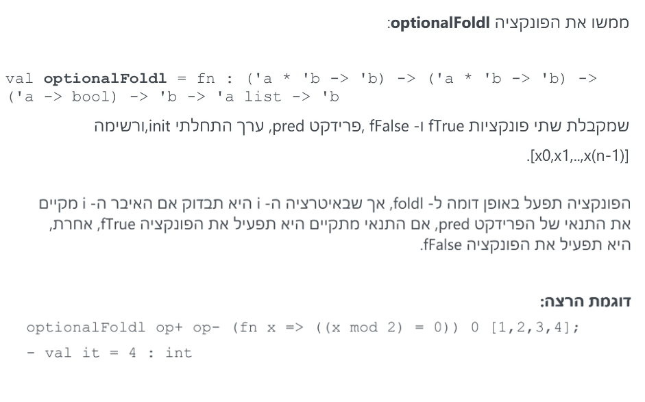

<!--vert-->

```sml
...
```
<!-- .element: data-thebe-executable-sml data-language="text/x-ocaml" -->

<!--vert-->

```sml
fun optionalFoldl fTrue fFalse pred init l =
    foldl (fn (a, b) => if pred a then fTrue (a,b) else fFalse (a,b)) init l;
```
<!-- .element: data-thebe-executable-sml data-language="text/x-ocaml" -->

---

### question 3

#### winter 2020

<!--vert-->

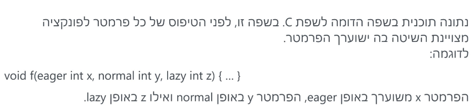

<!--vert-->

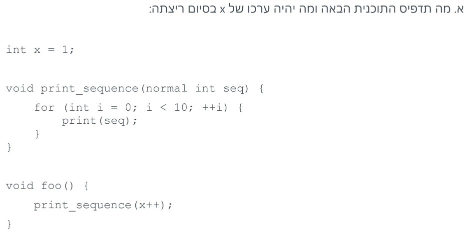

<!--vert-->

```
Output: 12345678910
End value: 11
```
<!-- .element: data-codeblock-editable -->

<!--vert-->

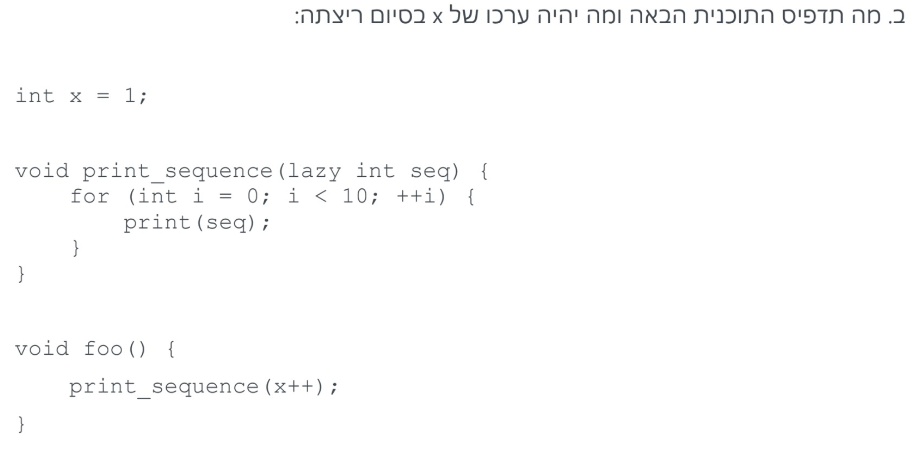

<!--vert-->

```
Output: 1222222222
End value: 2
```
<!-- .element: data-codeblock-editable -->

---

### question 1

#### summer 2013 moed b

<!--vert-->

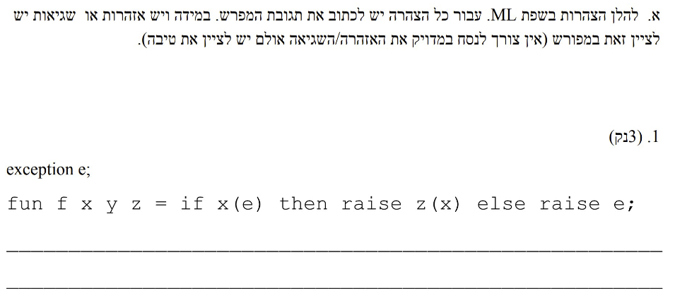

<!--vert-->

```sml
exception e;
fun f x y z = if x(e) then raise z(x) else raise e;
```
<!-- .element: data-thebe-executable-sml data-language="text/x-ocaml" -->

<!--vert-->

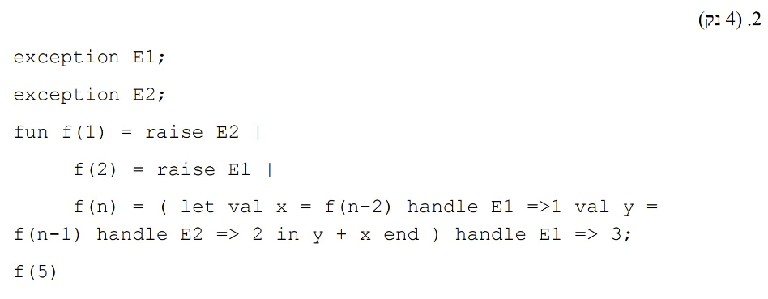

<!--vert-->

```sml
exception E1;
exception E2;
fun f(1) = raise E2 |
	f(2) = raise E1 |
	f(n) = ( let val x = f(n-2) handle E1 =>1 val y =
f(n-1) handle E2 => 2 in y + x end ) handle E1 => 3;
f(5);
```
<!-- .element: data-thebe-executable-sml data-language="text/x-ocaml" -->

<!--vert-->

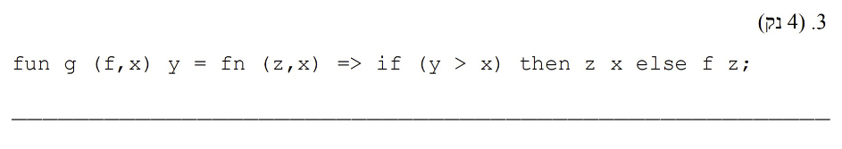

<!--vert-->

```sml
fun g (f,x) y = fn (z,x) => if (y > x) then z x else f z;
```
<!-- .element: data-thebe-executable-sml data-language="text/x-ocaml" -->

<!--vert-->

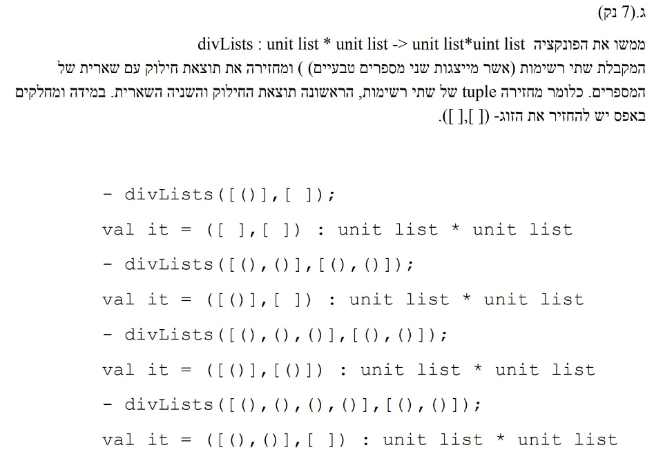

<!--vert-->

```sml
...
```
<!-- .element: data-thebe-executable-sml data-language="text/x-ocaml" -->

<!--vert-->

```sml
fun unitList 0 = []
  | unitList n = ()::(unitList (n - 1));

fun divLists (_, []) = ([], [])
  | divLists (x, y) =
    let val (ix, iy) = (List.length x, List.length y) in
      (unitList (ix div iy), unitList (ix mod iy))
    end;
```
<!-- .element: data-thebe-executable-sml data-language="text/x-ocaml" -->
